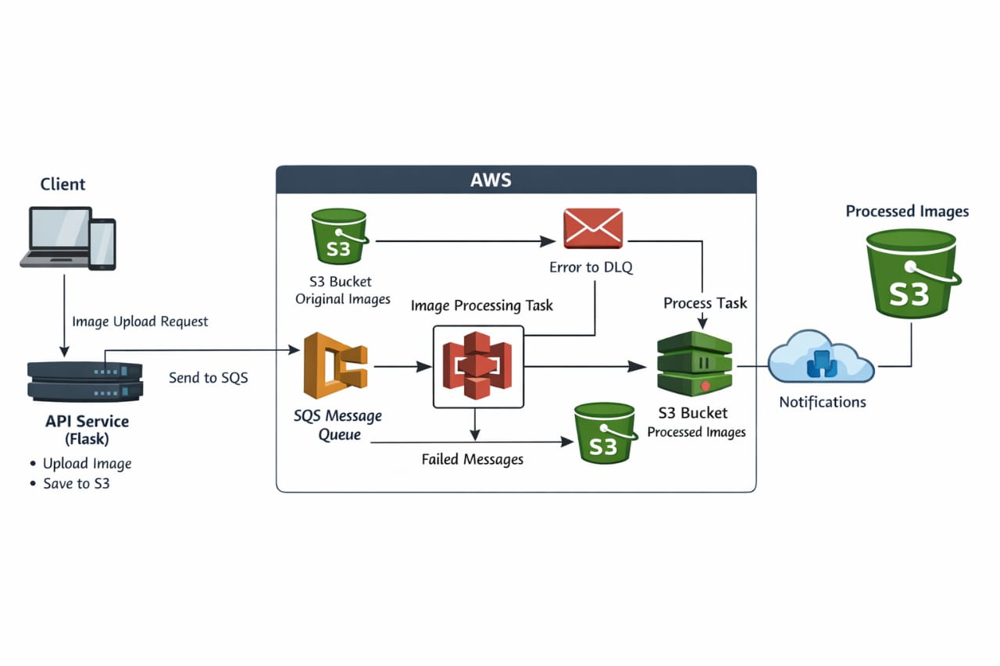

# PropelHQ Image Processing Service

An event-driven image processing system built with Flask, AWS S3, AWS SQS, and Docker.

---

## Architecture

Client → POST /images/upload → API Service → S3 (raw) + SQS message  
→ Worker polls SQS  
→ Downloads raw image  
→ Resizes to 150×150 (preserving aspect ratio)  
→ (Optional) Adds "PropelHQ" watermark  
→ Uploads to S3 (processed)  
→ Deletes SQS message  

Client → GET /images/processed/{id} → API Service → pre-signed URL

---

## Project Structure

propelhq-image-service/  
├── api-service/  
├── worker-service/  
├── tests/  
│   └── integration/  
├── docs/  
│   └── architecture.png  
├── scripts/  
│   └── init.py  
├── docker-compose.yml  
├── .env.example  
├── .github/workflows/ci-cd.yml  
└── README.md  

---

## Features

- Event-driven architecture using SQS  
- Asynchronous image processing  
- Image resizing (150×150 with aspect ratio)  
- Optional watermarking support ("PropelHQ")  
- Fault-tolerant worker with retry logic  
- Dead Letter Queue (DLQ) support  
- Local AWS simulation using LocalStack  
- Fully containerized using Docker  
- Unit and integration testing  

---

## Quick Start (Local — Docker)

### Prerequisites

- Docker & Docker Compose installed  
- Port 5000 and 4566 free  

---

### 1. Clone and configure

git clone <your-repo-url>  
cd propelhq-image-service  

cp .env.example .env  

---

### 2. Start services

docker compose up --build  

This starts:
- LocalStack (S3 + SQS)  
- API Service (port 5000)  
- Worker Service  

---

### 3. Upload Image

curl -X POST http://localhost:5000/images/upload -F "image=@test.jpg"  

Response:

{
  "image_id": "uuid",
  "message": "Image upload initiated"
}

---

### 4. Get Processed Image

curl http://localhost:5000/images/processed/<image_id>  

---

## API Documentation

### POST /images/upload

Upload image (JPEG, PNG only)

| Code | Description |
|------|------------|
| 202  | Accepted |
| 400  | Invalid request |
| 500  | Server error |

---

### GET /images/processed/{image_id}

| Code | Description |
|------|------------|
| 200  | Returns processed image URL |
| 404  | Not found |
| 500  | Error |

---

### GET /health

200 OK → { "status": "ok" }

---

## Running Tests

### API Unit Tests

cd api-service  
pip install -r src/requirements.txt pytest  
pytest tests -v  

---

### Worker Unit Tests

cd worker-service  
pip install -r src/requirements.txt pytest Pillow  
pytest tests -v  

---

### Integration Tests

docker compose up -d  

pip install requests pytest pillow boto3  
pytest tests/integration -v --integration  

---

## Environment Variables

| Variable | Default |
|----------|--------|
| AWS_ACCESS_KEY_ID | test |
| AWS_SECRET_ACCESS_KEY | test |
| AWS_REGION | us-east-1 |
| AWS_ENDPOINT_URL | http://localstack:4566 |
| S3_BUCKET_RAW | raw-images-propelhq |
| S3_BUCKET_PROCESSED | processed-images-propelhq |
| SQS_QUEUE_URL | LocalStack URL |
| WATERMARK_TEXT | PropelHQ |

---

## CI/CD Pipeline

Includes:
- API unit tests  
- Worker unit tests  
- Integration tests  
- Docker image build  

.github/workflows/ci-cd.yml  

---

## Final Notes

- Uses LocalStack to simulate AWS services locally  
- Fully asynchronous processing using SQS  
- Production-style microservice architecture  